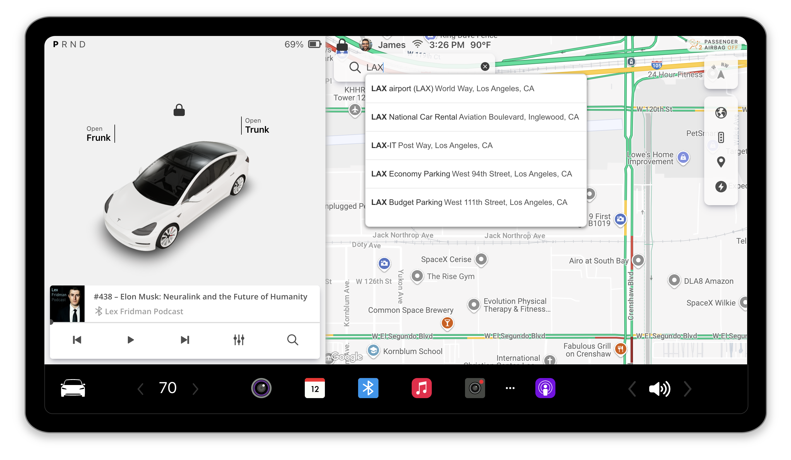

# Tesla Infotainment Simulator (WIP)

Experience a simulated Tesla infotainment system in your browser!

[Live Demo](https://jamesalmeida.github.io/tesla-infotainment/)



## Features to try out

- Realistic 3D model of Tesla Model Y. Try opening the trunk and frunk!
- Interactive infotainment system simulation. Play a podcast, adjust the volume, etc.
- Put the car in reverse (Click the R) and see what's behind you!
- Try searching on the map. Turn on traffic or different map styles.
- Check out the keyboard shortcuts below for more controls.
- Working on more responsive design for various screen sizes. Works best on desktop but you can try it out on your phone in landscape mode too. 
- Adding features periodically. Leave a feature request in the issues section ^_^

## Keyboard Shortcuts
- Shift + Left Arrow: Toggle left turn signal
- Shift + Right Arrow: Toggle right turn signal
- Shift + H: Toggle hazard lights
- Shift + F: Toggle frunk (front trunk)
- Shift + T: Toggle trunk
- Shift + M: Focus on Navigate Input
- Shift + C: Backup Camera

### Gear Selection
- P: Park
- R: Reverse
- N: Neutral
- D: Drive

### Music Controls
- Space: Play/Pause
- Shift + <: Previous track
- Shift + >: Next track

## Quick Start

To run the project locally:

1. Clone the repository:
   ```
   git clone https://github.com/jamesalmeida/tesla-infotainment.git
   cd tesla-infotainment
   ```

2. Install dependencies:
   ```
   npm install
   ```

3. Use the `.env.template` to create your own `.env` file. Add your API key for [Google Maps](https://cloud.google.com/maps-platform) and also a mapID for the maps styles to match Tesla's car maps. You can use mine (it's in the template) or create your own.


4. Start the development server:
   ```
   npm start
   ```

4. Open [http://localhost:3000](http://localhost:3000) in your browser.

## Build for Production

To create a production-ready build:

```
npm run build
```

This command builds the app for production to the `build` folder, optimizing the build for the best performance.

### `npm run deploy`
To make this project work as a Github Page, I added this command to deploy to a Github Page. You'll want to add the `PUBLIC_URL` to your `.env` file to point to your Github Pages URL.


This project was bootstrapped with [Create React App](https://github.com/facebook/create-react-app).

### Thanks

- Want to thank Ameer Studio for sharing the [3D model of the Tesla Model 3](https://sketchfab.com/3d-models/tesla-2018-model-3-5ef9b845aaf44203b6d04e2c677e444f) I'm using in the simulator.
- Also thanks to Vasilj Miloevi for the [loading screen circle animations](https://codepen.io/eboye/pen/ANPxVX) that I used for the loading screen.
- Thanks to Patrick Stillhart for sharing the [OutRun video game on Codepen](https://codepen.io/arcs/pen/aGzNKY) that I refactored to work inside of the Arcade in this project.

